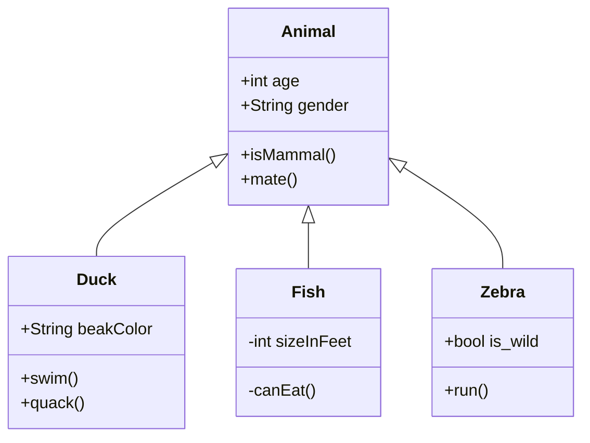
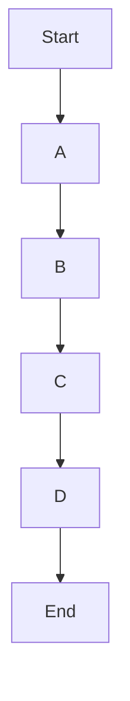
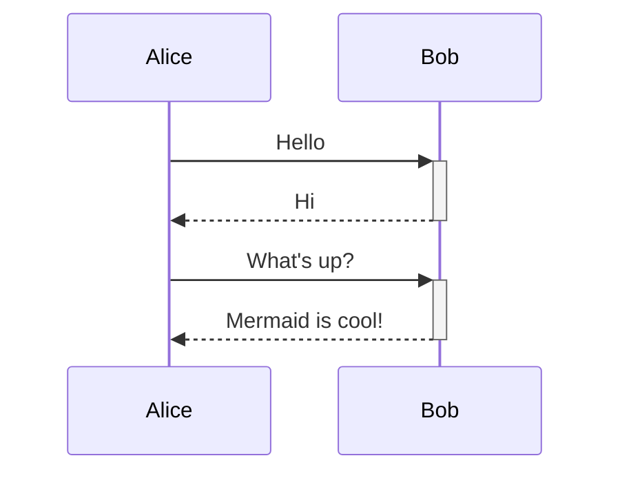

# Mermaid Samples

## Graph

```mermaid
  graph TD;
      A-->B;
      A-->C;
      B-->D;
      C-->D;
```

## Class Diagram

```mermaid
classDiagram
    Animal <|-- Duck
    Animal <|-- Fish
    Animal <|-- Zebra
    Animal : +int age
    Animal : +String gender
    Animal: +isMammal()
    Animal: +mate()
    class Duck{
      +String beakColor
      +swim()
      +quack()
    }
    class Fish{
      -int sizeInFeet
      -canEat()
    }
    class Zebra{
      +bool is_wild
      +run()
    }
```

## Flowchart

```mermaid	
flowchart TD
    Start --> A
    A --> B
    B --> C
    C --> D
    D --> End
```

## Sequence Diagram

```mermaid
sequenceDiagram
    participant Alice
    participant Bob
    Alice->>+Bob: Hello
    Bob-->>-Alice: Hi
    Alice->>+Bob: What's up?    
    Bob-->>-Alice: Mermaid is cool!            
```
